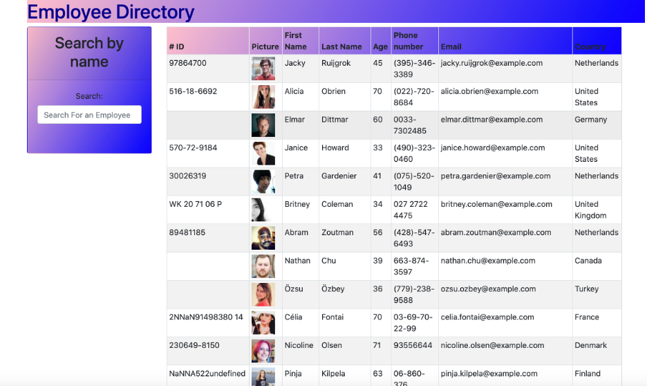

# React-Employee-Directory

[Heroku Page](https://react-employee-directory-new.herokuapp.com/)

React application which UI is broken into components, it manages component state, and responds to user events.

## Overview

Given a table of random employees, when the user loads the page, a table of employees renders. 

The user is able to:

  * Sort the table by at least one category

  * Search(Filter) the users by first or last name.
  

## User Story

* As a user, I want to be able to view my entire employee directory at once so that I have quick access to their information.

## Business Context

An employee or manager would benefit greatly from being able to view non-sensitive data about other employees. It would be particularly helpful to be able to filter employees by name.